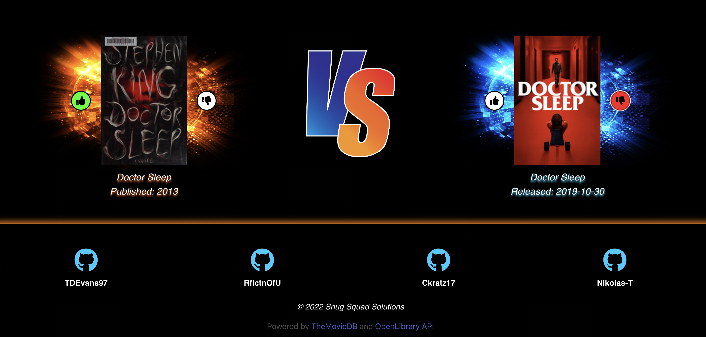

# BooksVsMovies

## Description
BooksVsMovies is a web application that allows the user to search for the title of a book or a movie and compares the two titles side by side. 
The user then is allowed to leave their mark on the page by giving the titles a thumbs-up, if they enjoy the title, or a thumbs-down, if they disliked the title.
The user can also display which one they prefer more by leaving a thumbs-up on one title and a thumbs-down on the other title.
If the user searches for a title that doesnt exist, the search will not go through.

## Technologies
BooksVsMovies is powered by the OpenLibrary Api and TheMovieDB.
The OpenLibrary Api was used to get the title info, the author, the published date, and the cover for all the books searched.
TheMovieDB was used to get the title info, the release date, and the poster for all the movies searched.
The styling was done with Css, Bulma, Font-Awesome, as well as Adobe Illustrator.
BooksVsMovies uses the jquery library for the javascript.

[LINK TO BooksVsMovies](https://rflctnofu.github.io/BooksVsMovies/)
